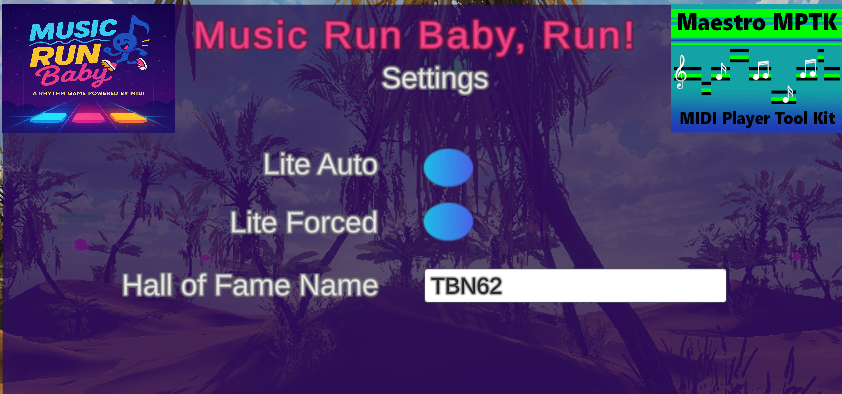
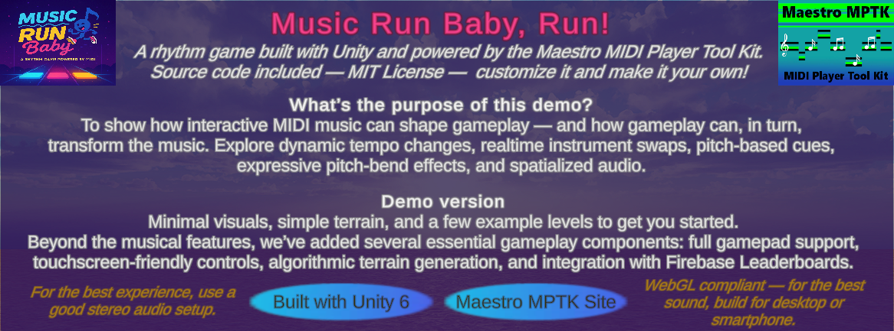

# ProtoMusicRun - Maestro MIDI Rhythm Demo  
*A rhythm game built with Unity and powered by the Maestro MIDI Player Tool Kit.*

---

## 📸 Screenshots  
A quick look at the demo in action:

<h3 align="center">Level 2</h3>

  
   
  <em>Main Level — Gameplay</em>

  
   
  <em>Level 2 — Variant</em>

<h3 align="center">Some Information</h3>

  
   
  <em>Settings Menu: Lite mode and Firebase Leaderboards name</em>

  
   
  <em>Additional UI Screen</em>

<h3 align="center">Terrain Designer</h3>

  
   
  <em>Terrain Designer — View 1 - with MIDI settings</em>

  
   
  <em>Terrain Designer — View 2 - Vegetation and Terrain</em>

  
   
  <em>Terrain Designer — View 3 - Bonus & Instrument</em>

---

## 🎯 Purpose of this Demo  
This project demonstrates how **MIDI data can shape gameplay** — and how gameplay can dynamically influence the music.  
It showcases:  
- Dynamic **tempo changes** related to the player speed.  
- **Realtime Instrument swaps**.  
- **Sound cues** with pitch shifts effects for bonus.
- **Pitch-bend cues** efffect when player collide ab obstacle.
- **Spatial audio** features is helping searching the goal. 

**It's a Demo**
- Minimal visuals, simple terrain, and a few example levels to get you started.
- WebGL compliant — but for the best sound, build for desktop or smartphone - and use a good stereo audio setup.

---

## 🕹️ Gameplay & Features  
Beyond the musical system, this demo includes several essential components of a functional game:  
- Gamepad support  
- Touchscreen-friendly controls  
- Terrain editor + algorithmic generator (POC level!)
- Integration with Firebase Leaderboards  (Hall Of Fame)
- Example levels built with simple terrain and minimal visuals  

---

## 📦 About This Repository  
This project is provided as a **complete, open-source Unity demo** to help developers understand how to combine:  
- Unity 6  
- Maestro MIDI Player Tool Kit  
- Gameplay logic driven by MIDI  
- Procedural content  
- Online leaderboards, to resuse create your account with your secret key.  

**Source code included — customize it and make it your own!**

---

## 🔗 Important Links  
- Free version: [Maestro – Midi Player Tool Kit – Free](https://assetstore.unity.com/packages/tools/audio/maestro-midi-player-tool-kit-free-107994)  
- Pro version: [Maestro – Midi Player Tool Kit – Pro](https://assetstore.unity.com/packages/tools/audio/maestro-midi-player-tool-kit-pro-115331)  

> *Note: The demo uses the Free version by default. If you own the Pro version, you can easily integrate its advanced features.*

---

## 🚀 Getting Started  
1. Clone or download this repository  
2. Open the project in **Unity 6**  
3. Import the Maestro package (Free or Pro) from the Asset Store  
4. Press **Play** and explore the demo levels  
5. Modify, extend, and experiment freely  

---

## 🧩 Requirements  
- Unity 6  
- Maestro MIDI Player Tool Kit (Free or Pro)  
- Optional: Firebase setup for leaderboard posting  
- A good stereo audio setup for the best experience  

---

## 🛠️ Project Structure  
 - in progress

---

## 🤝 Contributing  
Contributions are welcome!  
Feel free to open issues, submit pull requests, or propose improvements.

---

## 📄 License  
This project is licensed under the **MIT License**.  
See the file [LICENSE](LICENSE) for more details.
