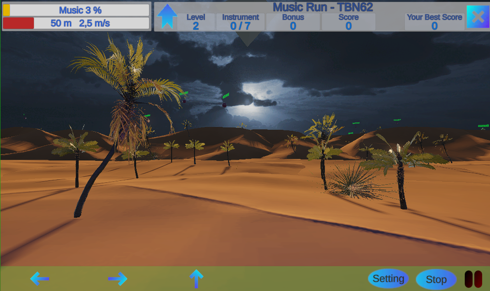
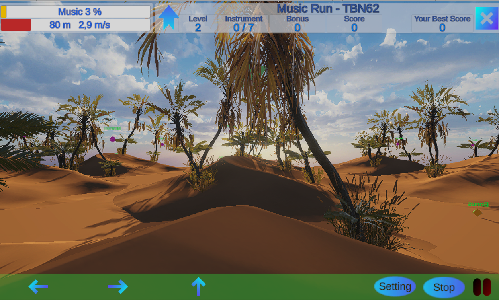
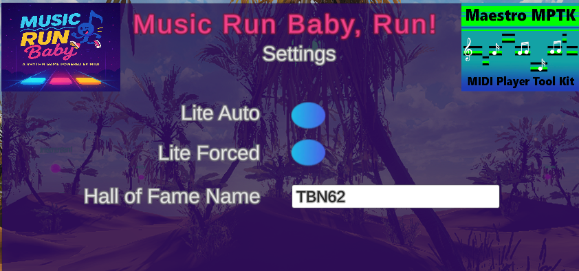
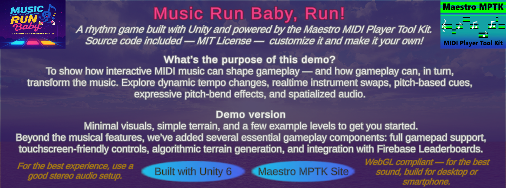
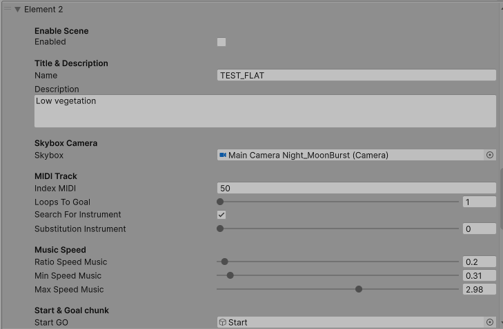
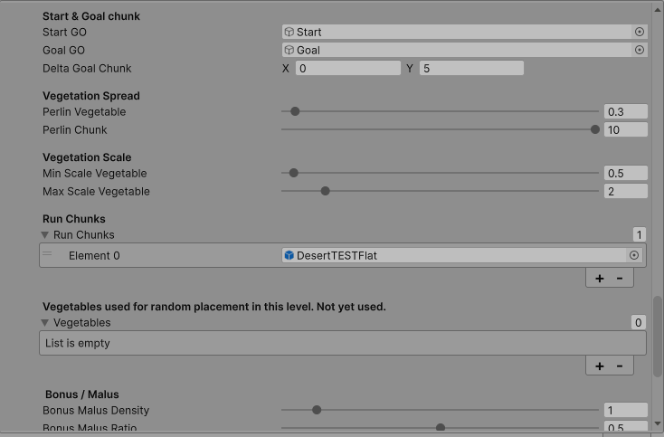
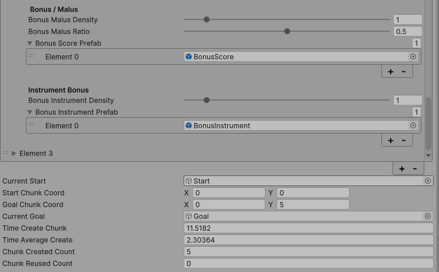

# ProtoMusicRun - Maestro MIDI Gameplay Demo
*A Unity game demo showing how MIDI can drive gameplay with Maestro MPTK.*

---

## Screenshots
A quick look at the demo in action.

<h3 align="center">Level 2</h3>

  
   
  <em>Main Level - Gameplay</em>

  
   
  <em>Level 2 - Variant</em>

<h3 align="center">Settings & UI</h3>

  
   
  <em>Settings: Lite mode and leaderboard player name</em>

  
   
  <em>Additional UI screen</em>

<h3 align="center">Terrain Designer</h3>

  
   
  <em>Terrain Designer - MIDI settings</em>

  
   
  <em>Terrain Designer - Vegetation and Terrain</em>

  
   
  <em>Terrain Designer - Bonus & Instrument</em>

---

## Story
A legendary music group, **Animals Disturbance**, famous across the galaxy, travels from planet to planet to perform their concerts.

After landing on a remote and arid world, disaster strikes: all of their instruments mysteriously vanish.

While the band begins rehearsal, you, a member of the technical crew, rush out to recover every missing instrument before the session ends.

There is one problem.

Right before landing, you drank a cup of **TurboCafe-7**, a hyper-caffeinated alien beverage known for its  
*"you won't stop. Literally."* side effect.

Now your body keeps accelerating on its own, and the only way to slow down is to crash into vegetation, rocks, and anything solid enough to absorb momentum.

You are not just running through a level.  
You are racing against the end of the music itself.

Find the instruments, control your speed the hard way, and save the concert.

---

## Purpose of This Demo
This project demonstrates how **MIDI data can shape gameplay**, and how gameplay can influence music in return.

### Musical interactions shown with MPTK
- Dynamic **MIDI speed/tempo feel** based on player speed
- Realtime **instrument restoration/swaps**
- Bonus/malus **pitch and transpose** effects
- **Pitch wheel** effect on collisions
- Spatialized music cues linked to world positioning

This is a demo project: it is intentionally simple in visuals and focused on playable technical patterns.

---

## Gameplay & Features
Beyond MIDI, the demo includes core game systems:
- Unity Input System (keyboard, gamepad, touch)
- Chunk-based terrain generation
- Bonus/malus pickups
- Instrument collection loop tied to music progression
- Optional Firebase leaderboard integration
- Lite mode for lower-end performance profiles

---

## What This Demo Teaches with MPTK
If you explore this repo as a learning project, you can study:
1. How to load and play MIDI per level
2. How to sync game progression with MIDI progression
3. How to react to gameplay events with direct MIDI/audio effects
4. How to design a game loop where music is a gameplay mechanic, not just background audio

---

## Game Input

### Touchscreen
- **Tap** -> Jump
- **Swipe** -> Turn

### Gamepad
- **Start** -> Start run / Continue / Pause flow depending on game state
- **A** -> Jump
- **Left Stick** -> Turn

### Keyboard
- **Enter** -> Start run / Continue / Pause flow depending on game state
- **Space** -> Jump
- **Left / Right Arrow** or **A / D** -> Turn

---

## Quick Start
1. Clone this repository
2. Open with **Unity 6** (tested with `6000.2.10f1`)
3. Import **Maestro MIDI Player Tool Kit** (Free or Pro), minimum version `1.6.2`
4. Open scene: `Assets/MusicBabyDemo/Scenes/MusicRunBabyDemo.unity`
5. Press Play

> Without MPTK imported, scripts using `MidiPlayerTK` will not compile.

---

## Requirements
- Unity 6
- Maestro MIDI Player Tool Kit (Free or Pro)
- Optional: Firebase config for leaderboard posting
- Recommended: good stereo audio setup

---

## Demo Scenes
- `MusicRunBabyDemo.unity` -> Main playable demo
- `TestTerrain.unity` -> Terrain/debug experimentation
- `ViewShader.unity` -> Shader/material experimentation

---

## Project Structure
- `Assets/MusicBabyDemo/Scenes` -> Demo scenes
- `Assets/MusicBabyDemo/Scripts` -> Gameplay code
- `Assets/MusicBabyDemo/Scripts/Terrain` -> Chunk generation and placement logic
- `Assets/MusicBabyDemo/Chunks` -> Chunk prefabs
- `Assets/MusicBabyDemo/Prefabs` -> Gameplay prefabs
- `Assets/MusicBabyDemo/Materials` -> Demo materials
- `Screenshots` -> README images

---

## Architecture at a Glance
- `GameManager` -> Game state orchestration and level flow
- `MidiManager` -> MPTK integration and musical gameplay effects
- `TerrainGenerator` -> Procedural chunk world generation
- `PlayerController` -> Movement and controls
- `BonusManager` / `ScoreManager` -> Gameplay rewards and scoring

---

## Known Limitations
- Visuals are intentionally lightweight and not production art quality
- WebGL audio behavior can differ from desktop/mobile native builds
- Mobile browser performance can vary significantly by device
- Scoring model is still a demo model and may evolve

---

## Important Links
- Maestro MPTK Free: https://assetstore.unity.com/packages/tools/audio/maestro-midi-player-tool-kit-free-107994
- Maestro MPTK Pro: https://assetstore.unity.com/packages/tools/audio/maestro-midi-player-tool-kit-pro-115331

---

## Contributing
Feedback and pull requests are welcome.  
If you improve MPTK/gameplay patterns or optimize performance, contributions are appreciated.

---

## Third-Party Notices
See `Assets/MusicBabyDemo/THIRD_PARTY_NOTICES.md`.

---

## Resume FR
`ProtoMusicRun` est une demo Unity qui montre comment mettre la musique MIDI au coeur du gameplay avec Maestro MPTK.

### Ce que montre la demo
- Vitesse musicale liee a la vitesse du joueur
- Effets musicaux gameplay (transpose, pitch, restauration d'instruments)
- Progression de niveau synchronisee avec la progression musicale
- Terrain en chunks et boucle de jeu orientee musique

### Demarrage rapide
1. Ouvrir le projet avec Unity 6
2. Importer Maestro MPTK (Free ou Pro, min `1.6.2`)
3. Ouvrir `Assets/MusicBabyDemo/Scenes/MusicRunBabyDemo.unity`
4. Lancer Play

---

## License
This project is licensed under the MIT License.  
See [LICENSE](LICENSE).
